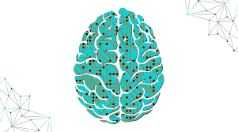

# **Machine Learning**
Machine learning is the study of computer algorithms that improve automatically through experience and by the use of data. It is seen as a part of artificial intelligence.

   

In class we have been working with how to clean and explore data for weeks, to finally reach a step above the try to predict the beahviour of data. 

Steps:

  1. Import SQL datframe into python
 
  2. Create a data frame in pandas/python

  3. Use EDA methods to explore the data

  4. Identify any needed clean steps 

  5. What pre-processing needed for this model? 

  6. T-T split and Run the model b

